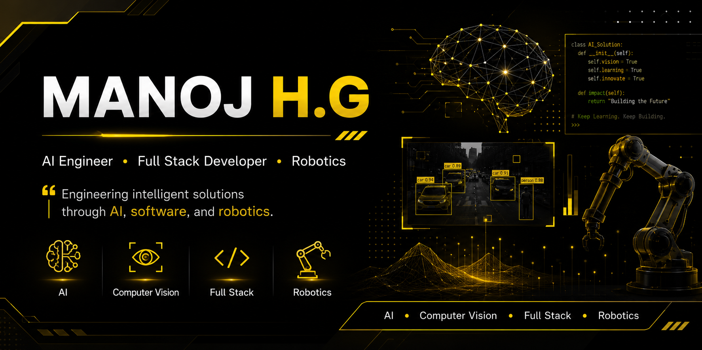
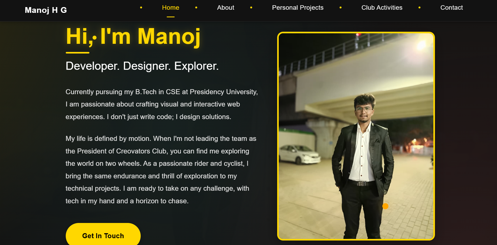
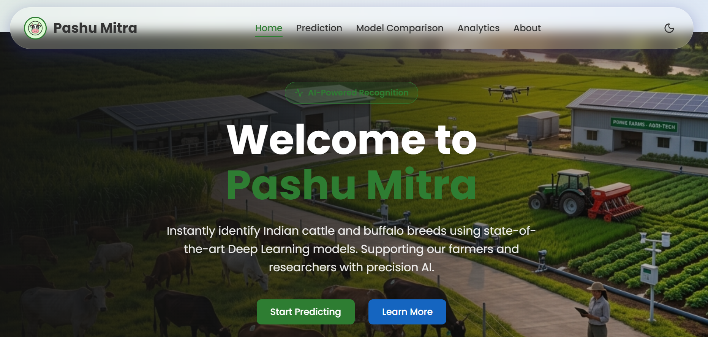
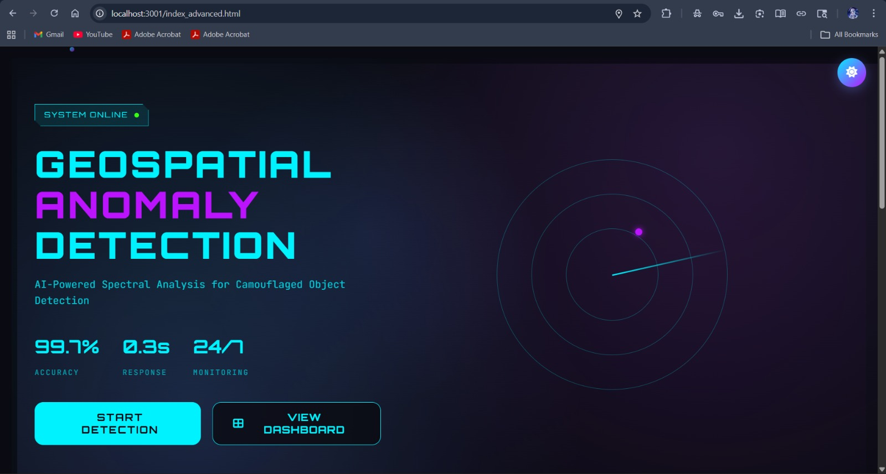
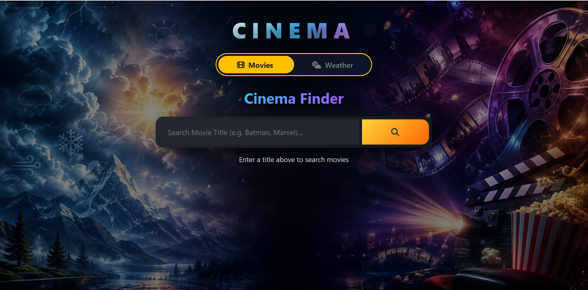

<!--========================================================-->
<!--                    MANOJ H.G                           -->
<!--========================================================-->

#  Hi, I'm Manoj H.G

### AI Engineer • Full Stack Developer • Computer Vision • Robotics

 

---

# 👨‍💻 About Me

🎓 **B.Tech Computer Science Engineering**

🏫 Presidency University, Bengaluru

📈 **CGPA : 9.18**

🏆 NVIDIA Accelerated AI Centre of Excellence Intern

👑 President — Creovators Club

🤖 Passionate about

- Artificial Intelligence
- Computer Vision
- Full Stack Development
- Robotics
- AI Agents

🌱 Currently Learning

- Spring Boot
- Cloud Computing
- AI Agents
- System Design

💡 **Mission**

> Engineering intelligent solutions through AI, software, and robotics.

 

---

# 💼 Experience

<table>

<tr>

<td width="50%">

## 🟢 NVIDIA Accelerated AI Centre of Excellence

### AI Engineering Intern

Worked on

- Deep Learning
- CNN
- Vision Transformer
- PyTorch
- NVIDIA H200 GPUs
- Stable Diffusion XL
- LLM Fine-Tuning

</td>

<td width="50%">

## 🔵 InAmigos Foundation

### Web Development Intern

Worked on

- Responsive Websites
- Shopify
- React
- Sanity CMS
- Deployment
- Backend Integration

</td>

</tr>

</table>

---

# 👑 Leadership

<table>

<tr>

<td>

## President

### Creovators Club

✔ Led 500+ students

✔ Organized Technical Events

✔ Conducted Workshops

✔ Promoted Innovation

✔ Student Mentoring

</td>

<td>

## Secretary

### Rangers & Rovers

✔ Event Coordination

✔ Leadership

✔ Team Management

</td>

</tr>

</table>

---

# 🛠 Tech Stack

## Programming Languages

---

## AI / Machine Learning

**Core Skills**

- Machine Learning
- Deep Learning
- Computer Vision
- CNN
- Vision Transformer (ViT)
- LLMs
- Hugging Face
- FastAPI

---

## Web Development

---

## Database

---

## Tools

---

# 🚀 Featured Projects

> Scroll down 👇
<!-- ======================================================== -->
<!--                 🚀 FEATURED PROJECTS                     -->
<!-- ======================================================== -->

# 🚀 Featured Projects

> **Building AI-powered software that solves real-world problems.**

 

<table>

<tr>

<td width="50%">

</td>

<td width="50%">

# 🐄 Pashu Mitra

### AI-Powered Cattle & Buffalo Breed Identification

An intelligent livestock identification platform using **Computer Vision** and **Deep Learning**.

### ⚡ Highlights

✅ Vision Transformer (ViT)

✅ CNN + ResNet50

✅ FastAPI Backend

✅ React Frontend

✅ NVIDIA H200 GPU Training

✅ Live Camera Detection

✅ Image Upload Prediction

### 🛠 Tech Stack

`React`
`FastAPI`
`PyTorch`
`ViT`
`CNN`

 

</td>

</tr>

</table>

---

 

<table>

<tr>

<td width="50%">

# 🔬 HSI Anomaly Detection

### Machine Learning • Hyperspectral Imaging

National Hackathon project focused on anomaly detection using hyperspectral imaging.

### ✨ Highlights

✅ Machine Learning

✅ Scientific Imaging

✅ Data Analysis

✅ Image Classification

✅ Research

### 🛠 Tech Stack

`Python`

`Machine Learning`

`HSI`

 

</td>

<td width="50%">

</td>

</tr>

</table>

---

 

<table>

<tr>

<td width="50%">

</td>

<td width="50%">

# 👤 AI Attendance System

### Face Recognition Attendance Platform

Computer Vision powered attendance management system.

### ⚡ Features

✅ Face Detection

✅ Attendance Automation

✅ Real-time Recognition

✅ Secure Logging

### 🛠 Tech Stack

`Python`

`OpenCV`

`Face Recognition`

`Computer Vision`

 

</td>

</tr>

</table>

---

 

<table>

<tr>

<td width="50%">

# 🌦 WEMDAS

### Weather & Movie Discovery Platform

A responsive web application that combines weather forecasts with movie discovery.

### Features

✅ Weather API

✅ Movie API

✅ Responsive UI

✅ Fast Search

### Tech Stack

`React`

`JavaScript`

`REST APIs`

 

</td>

<td width="50%">

</td>

</tr>

</table>

---

 

<table>

<tr>

<td width="50%">

</td>

<td width="50%">

# 🚦 Namma Naadu

### AI Smart Traffic Monitoring

**Currently Under Development**

### Planned Features

🚗 Helmet Detection

🚗 Wrong Side Detection

🚗 Signal Jump Detection

🚗 Overspeed Detection

🚗 Government Dashboard

🚗 Maps Integration

### Tech Stack

`React`

`FastAPI`

`YOLO`

`OpenCV`

</td>

</tr>

</table>

---

# 🌐 Portfolio

### Personal Portfolio Website

Showcasing my projects, experience, achievements, and technical journey.

---

# 🏆 Highlights & Achievements

| 🏆 Achievement | Status |
|---------------|--------|
| NVIDIA AI Internship | ✅ |
| President – Creovators Club | ✅ |
| TechTambola Runner-up | 🥈 |
| Smart India Hackathon (Internal Top 30) | 🚀 |
| FusionX National Hackathon | 🚀 |
| Campus Ambassador – Unlox | ⭐ |
| Letter of Recommendation – InAmigos | 📜 |

---

# 📜 Certifications

---

<!-- ======================================================== -->
<!--                 📊 GITHUB DASHBOARD                      -->
<!-- ======================================================== -->

# 📊 GitHub Dashboard

 

---

# 🏆 GitHub Trophies

---

# 📈 Contribution Graph

---

# 🐍 Contribution Snake

---

# 🎯 Current Focus

<table>

<tr>

<td>

🚀 Building **Namma Naadu**

</td>

<td>

🤖 Learning **AI Agents**

</td>

<td>

🌱 Mastering **Spring Boot**

</td>

</tr>

<tr>

<td>

☁ Exploring **Cloud Computing**

</td>

<td>

🧠 Improving **Computer Vision**

</td>

<td>

⚡ Open Source Contributions

</td>

</tr>

</table>

---

# 📅 2026 Goals

- ✅ Build production-ready AI applications
- ✅ Deploy Namma Naadu
- ✅ Contribute to Open Source
- ✅ Master Spring Boot
- ✅ Explore AWS Cloud
- ✅ Publish impactful AI projects
- ✅ Secure a Software Engineering role

---

# 🌐 Connect With Me

---

# 💡 Quote

### "Engineering intelligent solutions through AI, software, and robotics."

---

### ⭐ Thanks for visiting my profile!

If you like my work, consider starring my repositories.

