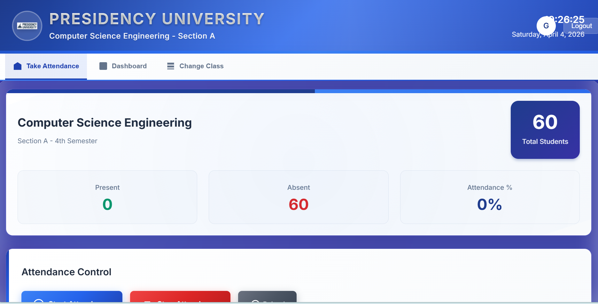

👋 Hi, I'm Manoj H.G

🤖 AI Engineer • 💻 Full Stack Developer • 👁️ Computer Vision • 🦾 Robotics

👨‍💻 About Me

🎓 B.Tech CSE — Presidency University
📈 CGPA: 9.18
🏆 NVIDIA AI Engineering Intern
👑 President — Creovators Club

⚡ Technologies I Know

Programming
🐍 Python • ☕ Java • C • JavaScript

AI / ML
🤖 Machine Learning • 🧠 Deep Learning • 👁️ Computer Vision
🔥 CNN • 🔬 Vision Transformers • 💬 LLMs • 🤗 Hugging Face

Frameworks & Backend
⚛️ React • 🚀 FastAPI • 🟢 Node.js • Express

Databases
🍃 MongoDB • 🐬 MySQL

Tools & Platforms
🐙 Git • GitHub • 💻 VS Code • 🔌 Arduino • ▲ Vercel

Currently Learning
☕ Spring Boot • ☁️ Cloud Computing • 🤖 AI Agents • 🏗️ System Design

 

🚀 Projects

<table>
<tr>
<td width="50%">

🐄 Pashu Mitra

AI-powered cattle & buffalo breed identification.

React • FastAPI • PyTorch • ViT • CNN

</td>
<td width="50%">

🔬 HSI Anomaly Detection

Hyperspectral imaging based anomaly detection.

Python • ML • HSI

</td>
</tr>

<tr>
<td width="50%">

👤 AI Attendance System

Face recognition based attendance automation.

Python • OpenCV • Face Recognition

</td>
<td width="50%">

🌦️ WEMDAS

Weather + movie discovery platform.

React • JavaScript • REST APIs

</td>
</tr>
</table>

💼 Experience

NVIDIA Accelerated AI Centre of Excellence — AI Engineering Intern
Deep Learning • CNN • ViT • PyTorch • H200 • LLMs

InAmigos Foundation — Web Development Intern
React • Shopify • Sanity CMS • Deployment

🏆 Highlights

🥇 NVIDIA AI Internship
👑 President — Creovators Club
🥈 TechTambola Runner-up
🚀 Smart India Hackathon — Internal Top 30
🚀 FusionX National Hackathon
⭐ Campus Ambassador — Unlox
📜 Letter of Recommendation — InAmigos

📊 GitHub Dashboard

 

🏆 GitHub Trophies

🎯 Current Focus

🤖 AI Agents • ☕ Spring Boot • ☁️ Cloud • 👁️ Computer Vision • ⚡ Open Source

🌐 Connect

🌐 Portfolio •
💼 LinkedIn •
🐙 GitHub •
📧 Email

  

⭐ Always Learning • Always Building

